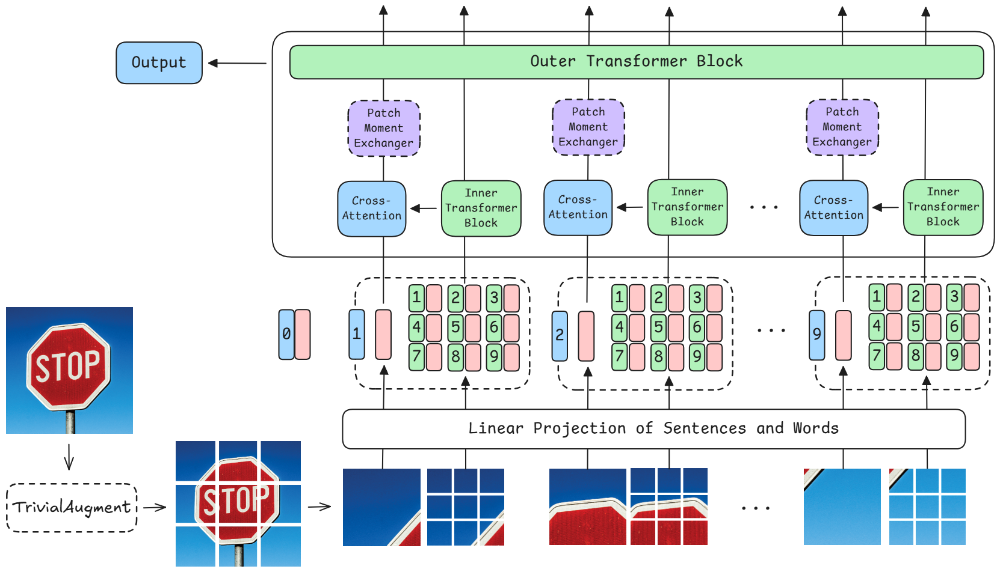
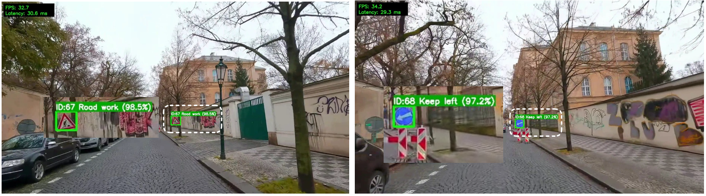
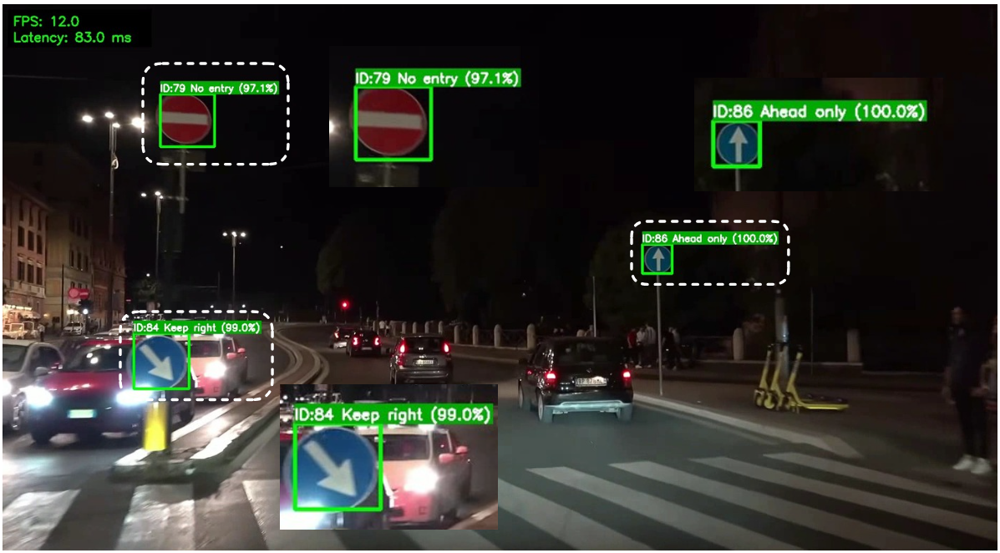
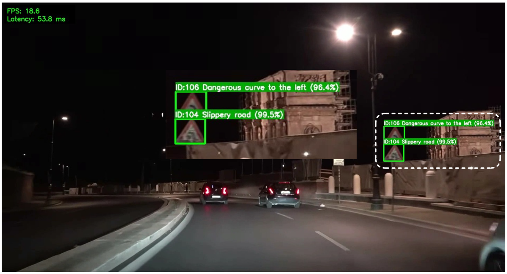

<div align="center">
  <h1>MaMa: Mamba-Transformer in Mamba-Transformer for Traffic Sign Recognition</h1>
  
  

  ⭐ If this work is helpful for you, please help star this repo. Thanks! ⭐
</div>

## 🏆 Achievement

This project was awarded **🥇 First Prize** in the **University-level Student Scientific Research Award** at **Ho Chi Minh City Open University**.

## 🛠️ Technologies
- `Python`
- `PyTorch` / `torchvision`
- `mamba_ssm` (State Space Models)
- `timm` / `einops` (Vision Transformers)
- `Ultralytics YOLO`
- `OpenCV` / `Pillow`
- `torchattacks`
- `torchsummary` / `ptflops`
- `matplotlib`

## 🚀 Getting Started

> [!CAUTION]
> **Linux is strongly recommended.** `mamba-ssm` requires CUDA-compiled kernels that are very difficult to build on Windows. Pre-built wheels are only available for Linux + CUDA.

### Prerequisites

Before installing, make sure you have:

| Requirement | Tested version | Minimum required |
|---|---|---|
| Python | Latest stable | 3.8+ |
| CUDA | `13.0` | `11.6+` |
| PyTorch | `2.13.0+cu130` | `1.12+` |
| Torchvision | `0.28.0+cu130` | - |
| NVIDIA GPU | - | Required |

---

### 1. Clone the repository

```bash
git clone https://github.com/naofunyan/Mamba-Transformer-in-Mamba-Transformer.git
cd Mamba-Transformer-in-Mamba-Transformer
```

### 2. Create a virtual environment (recommended)

**Using conda:**
```bash
conda create -n mama python=3.13
conda activate mama
```

**Or using venv:**
```bash
python -m venv .venv
source .venv/bin/activate          # Linux / macOS
# .venv\Scripts\activate           # Windows
```

### 3. Install `mamba-ssm`

> [!IMPORTANT]
> `mamba-ssm` is **not** included in `requirements.txt` and must be installed separately.
> Install PyTorch **before** running any of the commands below.

**Install PyTorch first** (skip if already installed in your environment):

```bash
pip install torch torchvision --index-url https://download.pytorch.org/whl/cu130
```

**Then install `mamba-ssm`** - choose one option:

| Option | Command | When to use |
|---|---|---|
| Core + causal-conv1d | `pip install mamba-ssm[causal-conv1d] --no-build-isolation` | **Recommended** |
| Core only | `pip install mamba-ssm --no-build-isolation` | Minimal install |
| causal-conv1d only | `pip install causal-conv1d>=1.4.0 --no-build-isolation` | If you need only the conv layer |

> [!NOTE]
> `--no-build-isolation` is **required** so that pip uses your existing CUDA-enabled PyTorch
> instead of pulling in a CPU-only `torch` inside an isolated build environment.

<details>
<summary>Installing Mamba-3 (from source)</summary>

```bash
MAMBA_FORCE_BUILD=TRUE pip install --no-cache-dir --force-reinstall \
  git+https://github.com/state-spaces/mamba.git --no-build-isolation
```

</details>

### 4. Install remaining dependencies

```bash
pip install -r requirements.txt
```
---

### Pretrained Weights

All pretrained model weights are included in the repository under `pretrained_models/`:

| File | Dataset | Model |
|---|---|---|
| `mama_model.pth` | GTSRB | MaMa-Ti |
| `mama_moex_model.pth` | GTSRB | MaMa-MoEx-Ti |
| `mama_model_tt100k.pth` | TT100K | MaMa-Ti |
| `mama_moex_tt100k_model.pth` | TT100K | MaMa-MoEx-Ti |

No separate download is needed — they are available after cloning the repository.

## 🪄 Training

**On GTSRB:**
```bash
python main_gtsrb.py
```

**On TT100K:**
```bash
python main_tt100k.py
```

> [!NOTE]
> Both scripts use hardcoded dataset paths at the top of each file.
> Make sure the dataset directories match the structure shown in the [Datasets](#-datasets) section before running.


## 🎬 Demo

Run inference on a single image using YOLO detection + MaMa-MoEx classification:

```bash
python demo/demo_image_single.py \
  --image test_images/1.jpg \
  --detector yolo11_model/gtsdbbest.pt \
  --classifier pretrained_models/mama_moex_model.pth
```

Run inference on a video:

```bash
python demo/demo_video_single.py \
  --video <path/to/video.mp4> \
  --detector yolo11_model/gtsdbbest.pt \
  --classifier pretrained_models/mama_moex_model.pth
```

## 📊 Datasets

GTSRB and TT100K datasets can be downloaded at:

- **German Traffic Sign Recognition Benchmark (GTSRB):** [](https://www.kaggle.com/datasets/naofunyannn/mama-gtsrb)

  The dataset directory should have the following structure:
  ```
  GTSRB
  ├── GTSRB_Final_Test_GT
  │   └── GT-final_test.csv
  ├── GTSRB_Final_Test_Images
  │   └── GTSRB
  │       ├── Final_Test
  │       │     └── GTSRB
  │       │         ├── 00000.ppm
  │       │         ├── 00001.ppm
  │       │         └── ...
  │       ├── test
  │       │     ├── 0000
  │       │     │   ├── 00243.ppm
  │       │     │   ├── 00252.ppm
  │       │     │   └── ...
  │       │     ├── 0001
  │       │     │   ├── 00001.ppm
  │       │     │   ├── 00024.ppm
  │       │     │   └── ...
  │       │     └── ...
  │       └── Readme-Images-Final-test.txt
  └── GTSRB_Final_Training_Images
      └── GTSRB
          ├── Final_Training
          │      └── Images
          │           ├── 00000
          │           │    ├── 00000_00000.ppm
          │           │    ├── 00000_00001.ppm
          │           │    └── ...
          │           ├── 00001
          │           │   ├── 00000_00000.ppm
          │           │   ├── 00000_00001.ppm
          │           │   └── ...
          │           └── ...
          └── Readme-Images.txt
  ```

- **Tsinghua-Tencent 100K (TT100K):** From the authors [](https://cg.cs.tsinghua.edu.cn/traffic-sign/) or our complete package [](https://www.kaggle.com/datasets/naofunyannn/mama-tt100k)

  The dataset directory should have the following structure:
  ```
  TT100K
  ├── marks
  │      ├── i1.png
  │      ├── i2.png
  │      └── ...
  ├── organized_test
  │      ├── i1
  │      ├── i2
  │      └── ...
  ├── organized_train
  │      ├── i1
  │      ├── i2
  │      └── ...
  ├── other
  │      ├── 23723.jpg
  │      ├── 23739.jpg
  │      └── ...
  ├── test
  │      ├── 2.jpg
  │      ├── 13.jpg
  │      └── ...
  ├── train
  │      ├── 23.jpg
  │      ├── 35.jpg
  │      └── ...
  ├── annotations_all.json
  ├── marks.jpg
  ├── report.pdf
  └── test_result.pkl
  ```


## 📈 Results

### 🔎 GTSRB - Classification Performance Comparison

| Group | Year | Model | FLOPs (G) | Params (M) | Accuracy (%) | F1-Score (%) | Precision (%) | Recall (%) | mAP (%) |
|---|---|---|:---:|:---:|:---:|:---:|:---:|:---:|:---:|
| CNN | 2024 | Two-Stage CNN | — | — | 98.86 | 98.86 | 98.90 | 98.54 | — |
| CNN | 2025 | Benfaress et al. | — | — | 98.90 | 98.54 | 98.67 | 98.42 | — |
| Transformer | 2023 | LNL-Ti | 1.2 | 6.1 | 97.90 | — | — | — | — |
| Transformer | 2023 | LNL-MoEx-Ti | 1.2 | 6.1 | 98.60 | — | — | — | — |
| Transformer | 2024 | Mingwin et al. | — | 9.61 | 98.41 | 98.42 | 98.51 | 98.41 | — |
| Transformer | 2025 | ECViT | 0.698 | 4.888 | 96.93 | — | — | — | — |
| Transformer | 2025 | TrafficSignFusion | — | — | 97.89 | — | — | — | 88.42 |
| Mamba | 2024 | MambaTSR | 56.98 | 0.09 | 99.00 | — | — | — | — |
| **Ours** | **2026** | **MaMa** | **1.71** | **8.62** | **99.71** | **99.61** | **99.63** | **99.61** | **99.25** |
| **Ours** | **2026** | **MaMa-MoEx** | **1.71** | **8.62** | **99.74** | **99.71** | **99.71** | **99.71** | **99.38** |

### 🔎 TT100K - Classification Performance Comparison

| Group | Year | Model | FLOPs (G) | Params (M) | Accuracy (%) | F1-Score (%) | Precision (%) | Recall (%) | mAP (%) |
|---|---|---|:---:|:---:|:---:|:---:|:---:|:---:|:---:|
| CNN | 2023 | SC-YOLO | — | 6.1 | — | 92.5 | 92.3 | 92.6 | 95.2 |
| CNN | 2024 | YOLOv7-TS | — | 34.7 | — | 89.92 | 92.36 | 87.60 | 92.45 |
| CNN | 2024 | YOLO-CCA | 99.2 | 33.8 | — | — | 86.3 | 88.0 | — |
| CNN | 2025 | Benfaress et al. | — | — | 99.08 | 99.07 | 99.08 | 99.27 | — |
| Transformer | 2025 | YOLOv8-ViT | — | — | 98.9 | 97.5 | 97.9 | 96.6 | — |
| Mamba | 2024 | MambaTSR | 56.98 | 0.09 | 99.43 | — | — | — | — |
| **Ours** | **2026** | **MaMa** | **1.71** | **8.63** | **99.15** | **99.10** | **99.11** | **99.10** | **97.96** |
| **Ours** | **2026** | **MaMa-MoEx** | **1.71** | **8.63** | **99.36** | **99.31** | **99.32** | **99.31** | **98.69** |

---

### 📹 Real-world Inference Results

<div align="center">
  
  <br /><br />
  
  <br /><br />
  
</div>